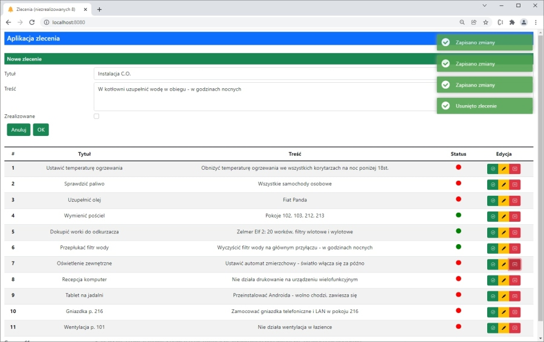

# Tasks

The fullstack application to managing tasks.



## Technologies

* [Node.js](https://nodejs.org/en/)
* [MongoDB](https://www.mongodb.com)
* [React](https://pl.reactjs.org/)

and

* [Express](https://expressjs.com/)
* [Mongoose](https://mongoosejs.com/)
* [Nodemon](https://nodemon.io/)
* [Bootstrap](https://getbootstrap.com/)
* [dotenv](https://github.com/motdotla/dotenv#readme)
* [react-modal](https://github.com/reactjs/react-modal)
* [axios](https://axios-http.com/)
* [react-notifications](https://github.com/tjrexer/react-notifications)

## Running

```
    $./cd backend 
    $./docker compose up -d    
    $./npm start
```
```
    $./cd frontend 
    $./npm start
```

***

# Zlecenia

Aplikacja umożliwiająca zarządzenianie zleceniami.


## Użyte technologie

* [Node.js](https://nodejs.org/en/)
* [MongoDB](https://www.mongodb.com)
* [React](https://pl.reactjs.org/)

oraz

* [Express](https://expressjs.com/)
* [Mongoose](https://mongoosejs.com/)
* [Nodemon](https://nodemon.io/)
* [Bootstrap](https://getbootstrap.com/)
* [dotenv](https://github.com/motdotla/dotenv#readme)
* [react-modal](https://github.com/reactjs/react-modal)
* [axios](https://axios-http.com/)
* [react-notifications](https://github.com/tjrexer/react-notifications)

## Uruchamianie

```
    $./cd backend 
    $./docker compose up -d
    $./npm start
```
```
    $./cd frontend 
    $./npm start
```
